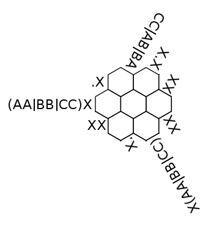

# Solving hexagonal regexp crosswords

Lets write a solver for this beast:


First step, break the problem down, we have a hexgrid, always a fun way to start. Each cell in the grid can take a letter as it's value. Along each row, column and diagonal of the grid... lets just call them "lines". Along each line of the grid is a regexp that constrains the values of the cells in that line.

The brute force approach would be to try every single combination of cell values and test that all the regexps match, 26 letters ** 127 cells = 1.6e38, that's clearly not going to work. So constraint propagation then.

This is going to be unpleasant, when you do constraint propagation it's not sufficient to test if the constraint is still valid, you want the constraint to tell you things about the line (etc) in question. For example if you are solving Sudoku and you've determined that one cell contains a 5, it's row constraint tells you that no other cell in that row can be a 5.

For the regexps we need to feed in the current possible values for the cells in the line, then have the regexp figure out in a relatively efficient manner every possible match and return the (hopefully reduced) set of possible values that respect the constraint.

Regexp libraries aren't built for this sort of reverse process, we're going to have to write our own. That'll require a parser and a matcher.

Efficiency is still a problem, when we hit "." in a regexp that's a 26 way branch and we don't want to have to explore all 26 of those. We're going to get around that by calling it one branch with an associated set of characters. When that branch matches a cell the match will also have an associated set of characters that will be the intersection of the branches characters and the characters still available for the matched cell. This'll make more sense later :)

Also note that some of the regexps have back references, those are going to significantly complicate the regexp matching.

So to recap:

1. hexgrid
2. regexp parser
3. regexp matcher
4. back references
5. constraint propagator

Lets get started then.

## 1: Hexgrid

There are a number of ways you can [store and work with hexgrids](http://www.redblobgames.com/grids/hexagons/) generally you want what is referred to as an axial system. The easiest way to understand this is we're going to skew the whole thing slightly so that it lines up with a normal 2d grid, so this:

```
  A B C
 D E F G
H I J K L
 M N O P
  Q R S
```

becomes:

```
A B C
D E F G
H I J K L
  M N O P
    Q R S
```

In the code the size variable is the width and height of this 2d grid and the hang variable is the size of the corner cutouts.

At each cell location we're going to store the set of characters that are still candidates for that position. We're going to store these in a dict indexed by x,y coordinates.

We're also going to need a list of all the lines, each of which is in turn a list of cell coordinates.

And for convenience we're also going to want a mapping from each cell to the lines it participates in and couple of helper functions we'll need later.

``` python
class Grid(object):
    def __init__(self, size):
        hang = size // 2
        self.size = size
        self.hang = hang

        # line is a list of cell locations
        # [[cell_index...]...]
        self.lines = []

        # maps cell indicies to a set of line indicies
        # {cell_index: {line_index...}}
        self.cell_lines = defaultdict(set)

        # cell is a set of possible values for that location indexed by (row, col)
        # {(row, col): {possible_value...}}
        self.cells = {}

        # rows
        for y in range(size):
            cell_ids = []
            for x in range(max(0, y-hang), min(size, y+hang+1)):
                cell_ids.append((x, y))
            self.lines.append(cell_ids)

        # cols
        for x in range(size):
            cell_ids = []
            for y in range(max(0, x-hang), min(size, x+hang+1)):
                cell_ids.append((x, y))
            self.lines.append(cell_ids)

        # diagonals
        for i in range(size):
            cell_ids = []
            if i < hang:
                length = size - hang + i
                start_x = length - 1
                start_y = size - 1
            else:
                length = size + hang - i
                start_x = size - 1
                start_y =  length - 1
            for j in range(length):
                cell_ids.append((start_x - j, start_y - j))
            self.lines.append(cell_ids)

        # cells and cell_lines
        for line_id, cells in enumerate(self.lines):
            for cell_id in cells:
                self.cells[cell_id] = set(LETTERS)
                self.cell_lines[cell_id].add(line_id)

    def copy(self):
        new = copy.copy(self)
        new.cells = copy.deepcopy(self.cells)
        return new

    def solved(self):
        return all(len(c) == 1 for c in self.cells.values())

    def valid(self):
        return all(c for c in self.cells.values())
```

## 2: Regexp Parser

Looking at our puzzle the extent of the regexp syntax in play seems to be:

```
OrChain, a chain of things separated by | characters
    ExpressionList
    OrChain | ExpressionList

ExpressionList, a series of more basic expressions each of which may have a modifier
    ModifierExpression
    ExpressionList ModifiderExpression

ModifierExpression, a basic expression, optionally modified with a *, + or ?
    BasicExpression
    BasicExpression *
    BasicExpression +
    BasicExpression ?

BasicExpression, characters, character classes, "."'s, "()" and back references
    CHARACTER
    [ CharacterClass ]
    .
    ( OrChain )
    \ DIGIT

CharacterClass
    ^ Characters
    Characters

Characters
    CHARACTER
    Characters CHARACTER
```

Now we could break out a proper parsing toolkit with lexers and all that. But I'm not familiar with the Python ones and this grammar is fairly simple, so instead we'll just cowboy up a recursive descent solution.

It's useful to step back for a second and think about the matching system that comes next, because the output of the parser will be matchers. The easiest structure for those is to build a tree of expression objects with a separate class for each expression type.

The most complicated part of this grammar is BasicExpression, as mentioned in the intro we're going to work with sets of possible characters in each position. That reduces the first 3 clauses of basic expression to being variations of character classes. The 4th clause we just recurse into OrChain and given the pain that back references are going to bring we probably want that in it's own class. So we'll make BasicExpression a function that delegates to the CharacterClass, OrChain and BackReference classes.

``` python
def get_char(e, chars):
    if e and e[0] in chars:
        return e.pop(0)
    else:
        return None

class Matcher(object):
    def __init__(self, regex_str):
        l = list(regex_str)
        self.exp = OrChain(l)
        assert not l, l  # check we consumed the whole string

class OrChain(object):
    def __init__(self, e):
        self.options = [ExpressionList(e)]
        while get_char(e, "|"):
            self.options.append(ExpressionList(e))

class ExpressionList(object):
    def __init__(self, e):
        self.expressions = [ModifierExpression(e)]
        while e and e[0] in "[(\\." + LETTERS:
            self.expressions.append(ModifierExpression(e))

class ModifierExpression(object):
    def __init__(self, e):
        self.expression = BasicExpression(e)
        self.modifier = get_char(e, "*+?")

def BasicExpression(e):
    if get_char(e,"["):
        negate = get_char(e, "^")
        letters = set()
        l = get_char(e, LETTERS)
        while l:
            letters.add(l)
            l = get_char(e, LETTERS)
        if negate:
            letters = set(LETTERS) - letters
        assert get_char(e, "]")
        res = CharacterClass(letters)
    elif get_char(e, "("):
        res = OrChain(e)
        assert get_char(e, ")")
    elif get_char(e, "\\"):
        res = BackReference(e)
    elif get_char(e, "."):
        res = CharacterClass(LETTERS)
    else:
        c = get_char(e, LETTERS)
        assert c
        res = CharacterClass(c)
    return res

class BackReference(object):
    def __init__(self, e):
        self.group = int(get_char(e, DIGITS))
        assert self.group

class CharacterClass(object):
    def __init__(self, options):
        self.options = set(options)
```

## 3: Regexp Matcher

The matching process applies a regular expression to a line represented as a list of the sets of the possible characters for each cell in the line. It will return an updated list of sets hopefully with some possible characters eliminated. Internally we're going to have it generate every possible match (again as lists of sets of possible characters) and then fold them together to produce the final list.

As an example imagine we match the regexp `[AB]+C+` to the line `{ABC}{ABC}{ABC}`, the possible matches are `{AB}{C}{C}` and `{AB}{AB}{C}` these are then folded together into `{AB}{ABC}{C}` and we've successfully eliminated 3 characters.

We're going to generate the individual matches by recursively stepping down through the expression tree we built above and at each level yielding out all the matches (Python 3's yield from would be really nice here). To make this all easier to keep track of we're going to operate on immutable MatchState objects that capture the state part way through the matching process as a list of matched positions and a list of positions remaining to be matched.

``` python
class MatchState(namedtuple("MatchState", "remaining done")):
    __slots__ = ()

    def __new__(cls, remaining, done=()):
        remaining = tuple(remaining)
        done = tuple(done)
        return super(MatchState, cls).__new__(cls, remaining, done)

    def consume(self, chars):
        if self.remaining:
            hits = self.remaining[0] & chars
            if hits:
                yield MatchState(self.remaining[1:], self.done + (hits,))

class Matcher(object):
    def match(self, target):
        matches = [[set() for x in target]]
        for match in self.exp.match(MatchState(target)):
            if not match.remaining:
                matches.append(match.done)
        return [set(chain(*x)) for x in zip(*matches)]

class OrChain(object):
    def match(self, state):
        for option in self.options:
            for new_state in option.match(state):
                yield new_state

class ExpressionList(object):
    def match(self, state):
        def recurse(state, expressions):
            if expressions:
                for partial_state in expressions[0].match(state):
                    for new_state in recurse(partial_state, expressions[1:]):
                        yield new_state
            else:
                yield state

        for new_state in recurse(state, self.expressions):
            yield new_state

class ModifierExpression(object):
    def match(self, state):
        def recurse(state):
            for partial_state in self.expression.match(state):
                yield partial_state
                if len(partial_state.done) > len(state.done):
                    for new_state in recurse(partial_state):
                        yield new_state

        if self.modifier in list("?*"):
            yield state

        if self.modifier in list("+*"):
            for new_state in recurse(state):
                yield new_state
        else:
            for new_state in self.expression.match(state):
                yield new_state

class CharacterClass(object):
    def match(self, state):
        for new_state in state.consume(self.options):
            yield new_state
```

## 4: Back References

When we hit a back reference we need to find the results of matching the original group and then match on that exact same sequence again. This may of course reduce the available options further, we will need to reinsert the new result in place of the original group as the back reference constrains both the original match and the new match.

Consider this regexp `([AB]+)X\1.*` applied to this list of possible character sets `{AB}{AC}{X}{A}{AB}{AC}`, the original group will match with the first 2 positions producing `{AB}{A}` then the back reference will attempt to match that against the last 3 positions, it will consume 2 of them producing `{A}{A}`, so our final match will end up as `{A}{A}{X}{A}{A}{AC}`.

To implement this we need 3 new functions on MatchState, one each to mark the start and end of a group and one consume that group again via a back reference. Since parenthesis and OrChains have a 1-1 relationship we can call the start and end functions at the start and end of OrChain and treat the top level invocation as group 0.

``` python
class MatchState(namedtuple("MatchState", "remaining done groups")):
    def start_group(self):
        groups = self.groups + (None,)
        return MatchState(self.remaining, self.done, groups)

    def end_group(self, old_state):
        # old_state must be the state returned by create_group
        groups = list(self.groups)
        group_idx = len(old_state.groups) - 1
        assert groups[group_idx] is None
        groups[group_idx] = (len(old_state.done), len(self.done))
        return MatchState(self.remaining, self.done, groups)

    def consume_group(self, index):
        start, end = self.groups[index]
        consume = tuple(o & n for o, n in zip(self.done[start:end], self.remaining))
        if all(consume) and len(consume) == end - start:
            remaining = self.remaining[len(consume):]
            done = self.done[:start] + consume + self.done[end:] + consume
            return MatchState(remaining, done, self.groups)

class OrChain(object):
    def match(self, state):
        state = state.start_group()
        for option in self.options:
            for new_state in option.match(state):
                yield new_state.end_group(state)

class BackReference(object):
    def match(self, state):
        new_state = state.consume_group(self.group)
        if new_state:
            yield new_state
```

# 5: Constraint Propagation

Now that all the pieces are in place we can get down to solving the puzzle. The process is fairly straight forward, we fill each grid cell with the full set of letters. We place all the constraints in a queue, we don't care about the order of the queue so we use a set as that also eliminates duplicates. Then for each constraint in the queue we extract it's cells from the gird, match them against the regexp and write the updated cells back. Whenever the value of a cell changes we add all the constraints it participates in to the queue again. Repeat until the queue is empty.

``` python
def propagate(grid, matchers):
    queue = set(range(len(grid.lines)))
    while queue:
        line_id = queue.pop()
        cell_ids = grid.lines[line_id]
        old_cells = [grid.cells[cell_id] for cell_id in cell_ids]
        new_cells = matchers[line_id].match(old_cells)
        for cell_id, old_cell, new_cell in zip(cell_ids, old_cells, new_cells):
            if old_cell != new_cell:
                grid.cells[cell_id] = new_cell
                queue.update(grid.cell_lines[cell_id])
```

## 6: Search

You thought we were done didn't you? As it turns out the original problem can be solved entirely with constraint propagation, so the above is sufficient. However this is not always the case. Consider this puzzle:


This sets up a fun double loop structure among the 3 cells in the top left, in one loop they are all C's in the other loop there is a contradiction where they are all A's and B's at the same time, but the constraint propagator isn't smart enough to see that contradiction.

To solve more complex cases like this we will fall back on the brute force search we discounted at the top, with constraint propagation eliminating most of the search space that's now a viable solution.

First we propagate the grid, then  if it's not solved we try out each remaining possible value in a recursive manner, copying and propagating every time we try one until we find a consistent solution.

``` python
def search(grid, matchers):
    propagate(grid, matchers)
    if grid.valid():
        if grid.solved():
            yield grid
        else:
            for cell_id, cell in grid.cells.iteritems():
                if len(cell) > 1:
                    for value in cell:
                        new_state = grid.copy()
                        new_state.cells[cell_id] = {value}
                        for x in search(new_state, matchers):
                            yield x
                    break
```
